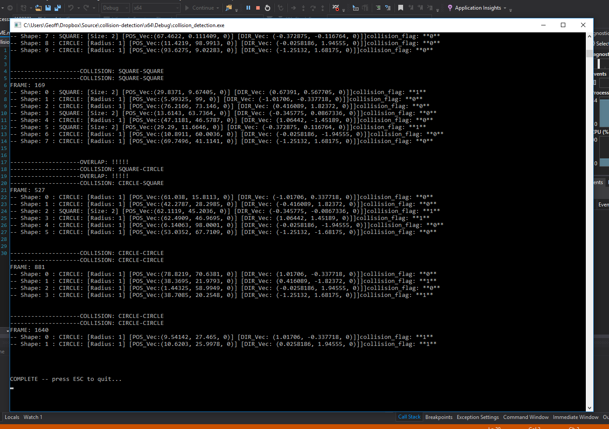

# Collision detection using Double Dispatch and Visitor Design Pattern

A console application with no GUI. Simulates a rectangular arena with circles and squares that bounce around within the boundaries at varying velocities. Collisions are detected and resolved using the visitor design pattern. Shapes are removed from the arena after a collision and the game continues until no shapes are left.

## Getting Started

Clone and build with visual studio.

All output is to the console.

## Instructions

Open main.cpp to configure the variables such as:
```
const int AMT_SHAPES		// How many shapes to generate
const float BOARD_X			// Size of the board in the X
const float BOARD_Y 		// Size of the board in the Y
const bool SQUARE_FLAG		// generate squares?
const bool CIRCLE_FLAG 		// generate circles?
const float V_MIN 			// greatest velocity in the - axis
const float V_MAX 			// greatest velocity in the + axis
```

Press ESC to exit the console once output is complete...

## Adding new shapes

** to add other shapes... eg. triangle

Note: be careful about where you include new classes to avoid circular references. If your getting very odd error messages that dont make a lot of sense. You could be encountereing a circluar ref.

1. In shape.h create a pure virtual function to accept your new shape type. eg.
	```
	virtual void accept(Visitor& v, triangle& c) = 0;
	```

2. Now create your shape class. It must be derived from Shape. eg.
	```
	class Triangle: public Shape {
		...
	}
	```
3. Create all the virtual functions in your new triangle class (check other classes and copy). eg.
	```
	void Triangle::accept(Visitor &v, Square &s) {
		v.visit(*this, s);
	}
	```
4. You'll also need to create a write method for printing the shape. Again ... just copy off another class
 
5. In Visitor.h add the collision (visit) possibilities that can occur with the following pure virtual functions. eg.
	```
	virtual void visit(Triangle &s1, Triangle &s2) = 0;		// Triangles can now collide with other Triangles
	virtual void visit(Triangle &s1, Square &s2) = 0;		// Triangles can now collide with other Square
	virtual void visit(Triangle &s1, Circle &s2) = 0;		// Triangles can now collide with other Circle
	virtual void visit(Triangle &s) = 0;
	```

6. Now you need to edit CollisionVisitor.cpp and CollisionVisitor.h, and create the virtual functions you defined in Visitor.h. These functions will define how a collision is resolved based on your shape type. Bear in mind when doing the maths here that the squares don't rotate as they move around the board.

	Important:
	* If a collision occurs, you need to set the collision_flag on shape2 (&s2) to true and set the collision_flag of the CollisionVisitor to true (copy other shapes essentially). 
	The CollisionVisitor will set shape1 (&s1) collision_flag at the end of the frame after all collisions for that shape have been resolved. All the colliding shapes are then deleted in one pass at the end of the frame using function:
	```
	Game::removeCollisions();
	```

7. That's the setup done for the design pattern. To include your shape in the game demo ...

	```
	Game::createShapes()	// add another case for your shape type here so that it is generated at game start. 
	```
	eg.
	```
	case TRIANGLES: {
				t = new Triangle(createVector(POS), createVector(DIR), 2.0f); // POS and DIR are just used to tell createVector() to return either a Vector of type position or direction (they are randomised slightly differently)
			} break;
	```
	Also edit the game constuctor to include your new Shape
	```
	Game::Game()			// the constructor currently uses a variable to determine whether you are using CIRCLES, SQUARES, or BOTH... your new shape will need to be factored into this.
	```

## Screenshots

Sample console output: 


## Authors

* **Geoff Whitehead - (https://github.com/geoffwhitehead)

## License

This project is licensed under the MIT License - see the [LICENSE.md](./LICENSE.md) file for details
